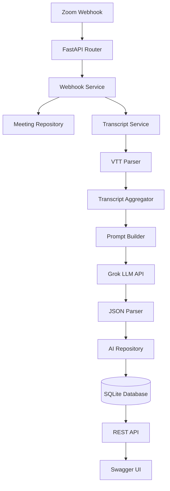
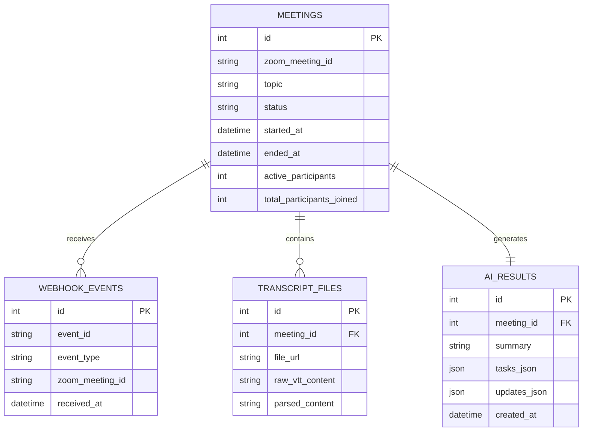

<div align="center">

# 🚀 AI Meeting Intelligence Platform

### AI-Powered FastAPI Backend for Automated Meeting Understanding

Transform Zoom meeting events into structured business intelligence using **FastAPI**, **Grok AI**, **WebVTT Processing**, and **Asynchronous Background Workers**.

---

[](https://www.python.org/)
[](https://fastapi.tiangolo.com/)
[](https://www.sqlalchemy.org/)
[](https://www.sqlite.org/)
[](https://docs.pydantic.dev/)
[](http://127.0.0.1:8000/docs)
[]()
[]()

---

### 🎯 Built For

Backend Engineering • AI Engineering • FastAPI • Event-Driven Systems • LLM Applications • Async Processing

</div>

---

# 📌 Overview

AI Meeting Intelligence Platform is an **AI-powered backend system** that automatically processes Zoom webhook events, parses meeting transcripts, and generates structured meeting intelligence using Large Language Models (LLMs).

Instead of storing raw transcripts, the platform transforms conversations into actionable business insights by generating:

- 📝 Executive Meeting Summaries
- ✅ Action Items
- 📢 Key Updates
- 📚 Structured Meeting Records

The backend is designed around an **event-driven architecture**, ensuring webhook acknowledgements remain fast while computationally intensive transcript parsing and AI inference execute asynchronously in background workers.

---

## 🎯 Why this project?

Modern online meetings generate large volumes of unstructured conversational data.

This project automates the transformation of meeting transcripts into structured business intelligence by combining webhook-driven architectures, transcript processing, asynchronous APIs, and Large Language Models.

## 📚 Table of Contents

- Overview
- Features
- Workflow
- Architecture
- AI Pipeline
- Project Structure
- Technology Stack
- Database Design
- API Reference
- Installation
- Configuration
- Running the Project
- AI Pipeline
- Testing
- Engineering Decisions
- Performance
- Security
- Scalability
- Roadmap
- Contributing
- Author

# ✨ Key Highlights

- ⚡ Event-driven FastAPI architecture
- 🎯 Automatic Zoom webhook processing
- 📄 WebVTT transcript aggregation
- 🤖 AI-powered meeting summarization using Grok
- 📋 Automatic action item extraction
- 📢 Meeting updates generation
- 🗄️ Persistent SQLite database
- 🔄 Async processing using BackgroundTasks
- 📖 Interactive Swagger API
- 🧩 Modular, scalable architecture
- 🧪 Unit-tested backend components
- 🔒 Environment-based configuration

---

# 🎬 Workflow

```text
Zoom Meeting
      │
      ▼
Zoom Webhook
      │
      ▼
FastAPI Endpoint
      │
      ▼
Webhook Validation
      │
      ▼
Meeting Database
      │
      ▼
Transcript Processing
      │
      ▼
VTT Parser
      │
      ▼
Transcript Aggregation
      │
      ▼
Prompt Builder
      │
      ▼
Grok AI
      │
      ▼
JSON Extraction
      │
      ▼
Summary
Tasks
Updates
      │
      ▼
SQLite Database
```
# 🏗️ System Architecture

The application follows a modular, layered architecture based on the **Repository-Service Pattern** with asynchronous AI processing.



---

# 🧠 AI Processing Pipeline

The AI pipeline converts raw meeting conversations into structured business intelligence.


---

# 📂 Project Structure

```
zoom_intelligence_system/
│
├── ai/
│   ├── llm_client.py
│   ├── prompt_builder.py
│   └── json_parser.py
│
├── api/
│   └── v1/
│
├── database/
│   ├── base.py
│   └── session.py
│
├── models/
│   ├── meeting.py
│   ├── transcript_file.py
│   ├── webhook_event.py
│   └── ai_result.py
│
├── parser/
│   └── vtt_parser.py
│
├── repositories/
│   ├── meeting_repository.py
│   ├── transcript_repository.py
│   ├── webhook_repository.py
│   └── ai_repository.py
│
├── schemas/
│   ├── ai.py
│   ├── meeting.py
│   └── webhook.py
│   
├── services/
│   ├── webhook_service.py
│   ├── transcript_service.py
│   └── meeting_service.py
│
├── workers/
│   └── meeting_processor.py
│
├── tests/
│
├── utils/
│
├── .env.example
├── requirements.txt
├── main.py
└── README.md
```

---

# 📖 Folder Responsibilities

| Folder | Responsibility |
|---------|----------------|
| **api/** | FastAPI routes and REST endpoints |
| **services/** | Business logic layer |
| **repositories/** | Database operations |
| **models/** | SQLAlchemy ORM models |
| **schemas/** | Pydantic request & response models |
| **parser/** | Parses Zoom WebVTT transcript files |
| **ai/** | Prompt engineering, LLM communication and JSON parsing |
| **workers/** | Background AI processing tasks |
| **database/** | Database initialization and session management |
| **tests/** | Unit and integration tests |
| **utils/** | Configuration and logging |

---

# ⚙️ Technology Stack

| Category | Technology |
|------------|------------|
| Language | Python 3.13 |
| Backend Framework | FastAPI |
| ASGI Server | Uvicorn |
| ORM | SQLAlchemy 2.0 |
| Database | SQLite + aiosqlite |
| Validation | Pydantic v2 |
| Environment | Pydantic Settings |
| HTTP Client | HTTPX AsyncClient |
| AI Provider | xAI Grok API |
| AI Model | grok-2-latest |
| API Docs | Swagger UI |
| Testing | Pytest |
| Transcript Format | Zoom WebVTT |
| Background Processing | FastAPI BackgroundTasks |

---

# 🔄 Request Lifecycle

```text
Zoom Meeting

        │

        ▼

Webhook Event

        │

        ▼

Webhook Validation

        │

        ▼

Database Logging

        │

        ▼

Background Worker

        │

        ▼

Download Transcript

        │

        ▼

Parse VTT

        │

        ▼

Aggregate Conversation

        │

        ▼

Prompt Builder

        │

        ▼

Grok AI

        │

        ▼

Structured JSON

        │

        ▼

Save Summary

        │

        ▼

REST API
```
---

# 🗄️ Database Design

The application persists all meeting intelligence in a normalized relational database using **SQLAlchemy 2.0 (Async)**.



---

# 📡 REST API

## Webhook APIs

| Method | Endpoint | Description |
|---------|----------|-------------|
| POST | `/api/v1/webhooks/zoom` | Receives Zoom webhook events |

---

## Meeting APIs

| Method | Endpoint | Description |
|---------|----------|-------------|
| GET | `/api/v1/meetings` | List all processed meetings |
| GET | `/api/v1/meetings/{meeting_id}` | Get meeting intelligence |
| POST | `/api/v1/meetings/process` | Manually process transcript |
| POST | `/api/v1/meetings/{meeting_id}/retry` | Retry AI pipeline |

---

# 📑 Swagger Documentation

Interactive API documentation is automatically generated by FastAPI.

After running the application, open:

```text
http://127.0.0.1:8000/docs
```

Swagger allows you to:

- Test all endpoints
- View request schemas
- View response schemas
- Execute webhook requests
- Validate payloads

---

# 🔑 Environment Variables

Create a `.env` file in the project root.

```env
DATABASE_URL=sqlite+aiosqlite:///./zoom_intelligence.db

LLM_PROVIDER=grok

GROK_API_KEY=YOUR_API_KEY

GROK_MODEL=grok-2-latest

ZOOM_WEBHOOK_SECRET_TOKEN=YOUR_SECRET
```

---

# 🚀 Installation

Clone the repository

```bash
git clone https://github.com/amrit-kaur11/zoom-meeting-intelligence.git
```

Move into the project

```bash
cd zoom-meeting-intelligence
```

Create virtual environment

```bash
python -m venv venv
```

Windows

```bash
venv\Scripts\activate
```

Linux / macOS

```bash
source venv/bin/activate
```

Install dependencies

```bash
pip install -r requirements.txt
```

Run the server

```bash
uvicorn main:app --reload
```

---

# ▶ Running the Project

After starting the server,

Open Swagger

```
http://127.0.0.1:8000/docs
```

Send a Zoom webhook payload.

The backend automatically

- validates payload
- logs webhook
- creates meeting
- aggregates transcripts
- invokes Grok
- stores AI insights

---

# 📩 Example Zoom Webhook

```json
{
  "event": "meeting.ended",
  "event_ts": 17234567,
  "payload": {
    "object": {
      "id": "987654321",
      "topic": "Demo Meeting"
    }
  }
}
```

---

# 🤖 Example AI Output

```json
{
  "summary": "The team discussed backend implementation, project timelines and deployment strategy.",

  "tasks": [
    "Integrate Grok API",
    "Deploy backend to Render",
    "Prepare final documentation"
  ],

  "updates": [
    "Webhook implementation completed",
    "Transcript parser completed",
    "AI integration completed"
  ]
}
```

---

# 🧠 Prompt Engineering

The application follows a structured prompting strategy.

```
Transcript

↓

Prompt Builder

↓

System Instructions

↓

Meeting Context

↓

Grok LLM

↓

Structured JSON

↓

Validation

↓

Database
```

Instead of allowing free-form responses, every AI response is validated using **Pydantic**, ensuring consistency before persisting to the database.

---

# 🧪 Testing

Run all tests

```bash
pytest
```

Run a specific test

```bash
pytest tests/test_webhooks.py
```

The project includes tests for

- Webhook processing
- AI pipeline
- Transcript parsing
- Repository layer
- Service layer

---

# 📸 Screenshots

> Add screenshots after deployment.

Suggested screenshots:

- Swagger UI
- Database Viewer
- AI Results
- Meeting APIs
- Architecture Diagram

```
docs/

    swagger.png

    database.png

    ai_results.png

    architecture.png
```
---

# 🏛️ Engineering Decisions

This project intentionally adopts a layered architecture instead of placing all business logic inside API endpoints.

### Why Repository Pattern?

The Repository Pattern separates business logic from database access, making the application:

- Easier to maintain
- Easier to unit test
- Database agnostic
- Cleaner to extend for PostgreSQL or other databases

Instead of API endpoints directly querying SQLAlchemy models, all persistence logic flows through repositories.

---

### Why Service Layer?

The Service Layer centralizes application logic such as:

- Meeting lifecycle management
- Transcript aggregation
- AI orchestration
- Participant tracking
- Webhook event routing

This keeps the API layer lightweight while making business rules reusable.

---

### Why Asynchronous Programming?

Meeting transcripts can become very large, and LLM requests are network-bound operations.

Using:

- `async` / `await`
- SQLAlchemy Async
- HTTPX AsyncClient
- FastAPI BackgroundTasks

prevents blocking incoming webhook requests and improves scalability.

---

### Why Background Processing?

Zoom expects webhook acknowledgements quickly.

Instead of performing transcript parsing and AI inference during the request, the application immediately returns HTTP 200 and delegates expensive work to background tasks.

Benefits:

- Faster webhook acknowledgement
- Better responsiveness
- Improved user experience
- Easier migration to Celery or distributed workers

---

# ⚡ Performance Considerations

The system includes several design choices to improve performance.

### Duplicate Webhook Detection

Webhook events are uniquely identified and stored.

Duplicate events are ignored, preventing:

- Duplicate AI requests
- Duplicate meeting records
- Duplicate transcript processing

---

### Transcript Aggregation

Instead of processing each `.vtt` file independently, transcript fragments are:

- Downloaded
- Parsed
- Cleaned
- Deduplicated
- Combined

before being sent to the language model.

This reduces token usage and improves AI output quality.

---

### Structured AI Outputs

The LLM is instructed to always return strict JSON.

Responses are validated using Pydantic before storage.

Advantages:

- Reliable parsing
- Strong typing
- Reduced runtime failures
- Predictable API responses

---

# 🔐 Security Considerations

Current implementation:

- Environment variables for secrets
- API keys excluded from version control
- Structured request validation with Pydantic

Production roadmap:

- Zoom HMAC Signature Verification
- OAuth 2.0 Authentication
- Role-based authentication
- Rate limiting
- Audit logging
- HTTPS termination
- Secret management

---

# 📈 Scalability Strategy

Current implementation supports:

- Asynchronous APIs
- Async database access
- Background processing
- Modular architecture

Future scaling plan:

```text
FastAPI

        │

        ▼

Redis Queue

        │

        ▼

Celery Workers

        │

        ▼

Multiple AI Workers

        │

        ▼

PostgreSQL

        │

        ▼

Load Balancer
```

This design enables horizontal scaling without major architectural changes.

---

# 🚧 Production Roadmap

## Completed

- [x] FastAPI Backend
- [x] Async SQLAlchemy
- [x] SQLite Integration
- [x] Zoom Webhooks
- [x] Meeting Lifecycle
- [x] Transcript Aggregation
- [x] VTT Parser
- [x] Grok AI Integration
- [x] JSON Validation
- [x] Background Processing
- [x] Swagger Documentation
- [x] Unit Testing

---

## Planned

- [ ] Celery + Redis
- [ ] PostgreSQL
- [ ] Docker
- [ ] Kubernetes
- [ ] CI/CD Pipeline
- [ ] Zoom OAuth
- [ ] HMAC Signature Verification
- [ ] WebSocket Notifications
- [ ] Cloud Deployment

---

# 💡 What This Project Demonstrates

This project showcases practical backend engineering skills required for modern AI-powered applications.

### Backend Engineering

- REST API Design
- FastAPI
- Repository Pattern
- Service Layer
- SQLAlchemy Async
- SQLite
- Pydantic
- Background Tasks

---

### AI Engineering

- Prompt Engineering
- LLM Integration
- Structured AI Outputs
- Transcript Processing
- JSON Validation
- Async HTTP APIs

---

### Software Engineering

- Clean Architecture
- Separation of Concerns
- Event-Driven Design
- Webhook Processing
- Logging
- Testing
- Configuration Management

---

# 🤝 Contributing

Contributions are welcome.

If you have ideas for improvements, feel free to:

1. Fork the repository
2. Create a feature branch
3. Commit your changes
4. Open a Pull Request

---

# 👩‍💻 Author

## Amrit Kaur

AI & Backend Engineer

GitHub: https://github.com/amrit-kaur11

LinkedIn: www.linkedin.com/in/amrit-kaur-a31b50251

---

# ⭐ If you found this project interesting

Please consider giving it a ⭐ on GitHub.

It helps increase the visibility of the project and supports future development.

---

<p align="center">

Built with ❤️ using FastAPI, SQLAlchemy, HTTPX, and Grok AI.

</p>